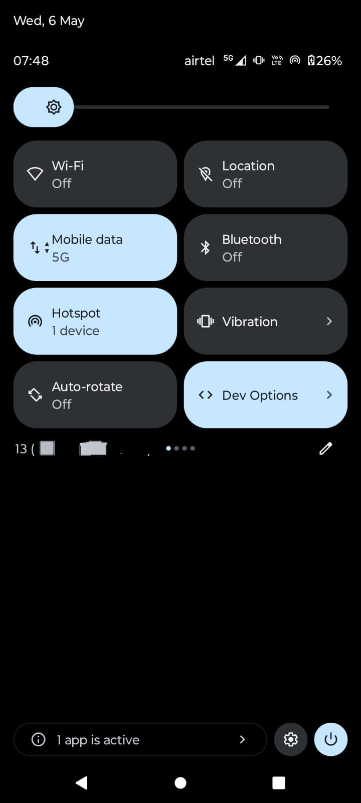

# adb-quickstart

A small kit of **non-root** tools that fix common Android development annoyances. Pick the tool you need — each one stands alone.

| Tool | What it solves | Where to look |
|---|---|---|
| **Dev Toggle** *(included in this repo)* | UPI apps (PhonePe / GPay / Paytm / banking apps) refuse to run while Developer Options is on. Toggle it off-and-on by hand and it's tedious. This is a custom Quick Settings tile that flips Developer Options + USB Debugging in one tap. | [`android-tile/`](android-tile/) |
| **One-tap USB Debugging tile** | Re-enabling USB Debugging from Settings every time. | [Tool A](#tool-a--one-tap-usb-debugging-tile) |
| **Boot-time wireless ADB** | `adb tcpip 5555` resets every reboot, and Android 11+ won't let you turn on Wireless Debugging without re-pairing. | [Tool B](#tool-b--persistent-wireless-adb-on-real-wifi) |
| **`wadb` script** | Wireless ADB doesn't work when the laptop's only internet is the phone's hotspot. Computer-side script that handles it. | [Tool C](#tool-c--wireless-adb-on-phone-hotspot-wadb-script) |

No phone rooting needed. Each tool is a one-time setup.

---

## Prerequisites

- **An Android phone.** Tools have different minimum versions; see each section.
- **A computer** (Windows / macOS / Linux).
- **A USB cable** for first-time setup.
- **Developer Options + USB Debugging turned on** on the phone (only needed during setup).

If you don't have Developer Options yet:
1. **Settings → About phone → tap "Build number" 7 times.**
2. Go to **Settings → System → Developer options → turn on USB Debugging.**

### Install ADB on the computer

Skip if you already have it (verify with `adb version`):

- **Windows:** `winget install Google.PlatformTools` then close and reopen your terminal.
- **macOS:** `brew install android-platform-tools`
- **Linux (Debian/Ubuntu):** `sudo apt install adb`
- **Linux (Arch):** `sudo pacman -S android-tools`

Plug the phone in, accept the **Allow USB debugging?** prompt, run `adb devices`. The phone should show as `device`.

---

## Dev Toggle (this repo)

A tiny Quick Settings tile that flips both `development_settings_enabled` and `adb_enabled` in one tap. Built specifically because UPI / banking apps refuse to run when Developer Options is enabled, and disabling-and-reenabling Developer Options manually every time is annoying.

<p align="center">
  
</p>

| Tile state | `development_settings_enabled` | `adb_enabled` |
|---|---|---|
| ON  | 1 | 1 |
| OFF | 0 | 0 |

**Min Android version:** 8.0 (Oreo, API 26).

**Use it on its own** — you don't need any of the wireless-ADB tools below. If all you want is "stop UPI apps complaining about Developer Options", install Dev Toggle and stop reading.

Setup is in [`android-tile/README.md`](android-tile/README.md). Short version:

```
cd android-tile
./gradlew assembleDebug             # Windows: .\gradlew.bat assembleDebug
adb install -r app/build/outputs/apk/debug/app-debug.apk
adb shell pm grant io.github.tarunswamy.devtoggle android.permission.WRITE_SECURE_SETTINGS
```

Then on the phone: open the **Dev Toggle** app once, swipe down twice, tap the pencil/edit icon, drag the **Dev Options** tile into your active tiles.

---

## Tool A — One-tap USB Debugging tile

A Quick Settings tile that toggles **only** USB Debugging (not the whole Developer Options switch). Useful if you don't care about UPI apps and just want to flip USB debugging on/off without diving into Settings.

This is a third-party app, not built by us. Install:

1. On the phone, install **Quick-Tile Settings** from F-Droid:
   https://f-droid.org/packages/com.rbn.qtsettings/
   (or sideload the APK from [GitHub releases](https://github.com/RBN-Apps/Quick-Tile-Settings/releases))
2. Open the app once so Android registers it.
3. From your computer (phone plugged in via USB):
   ```
   adb shell pm grant com.rbn.qtsettings android.permission.WRITE_SECURE_SETTINGS
   ```
4. On the phone: swipe down twice → tap the pencil/edit icon → drag the **USB Debugging** tile into your active tiles. Save.

Done — one tap toggles USB debugging. The auto-revert option in the app is great for "turn USB debugging back off after 10 min if I forget."

---

## Tool B — Persistent wireless ADB on real WiFi

**When to use:** both phone and laptop are on the same actual WiFi network (home, college, cafe).

This is a third-party app, not built by us.

1. On the phone, install **adb-auto-enable** APK from
   https://github.com/mouldybread/adb-auto-enable/releases
2. Open the app once.
3. From your computer:
   ```
   adb shell pm grant com.tpn.adbautoenable android.permission.WRITE_SECURE_SETTINGS
   ```
4. In the app's web UI (or in Settings → Developer options → Wireless debugging on the phone), do the **one-time pairing** — phone shows a 6-digit code; enter it where prompted.
5. **Critical for Motorola / Xiaomi / OnePlus / Huawei / Vivo (aggressive battery management):**
   - Settings → Apps → adb-auto-enable → Battery → **Unrestricted**
   - Make sure notifications are allowed (the foreground-service notification is what keeps the boot service alive)
6. Reboot once to verify. From your laptop:
   ```
   adb connect <phone-ip>:5555
   ```

After this, every time the phone boots, wireless ADB is auto-enabled and pinned to port 5555. No PC needed at boot.

**Limitation:** This step only works if the phone is connected to a WiFi network as a client (Android 11+ framework gate — see [Why](#why-the-hotspot-only-case-needs-tool-c) below). If you only ever use phone hotspot, jump to Tool C.

---

## Tool C — Wireless ADB on phone hotspot (`wadb` script)

**When to use:** your laptop's internet is the phone's hotspot, no other WiFi available.

This is the case Tool B can't fix on stock Android. The workaround is a small computer-side script that you run after plugging the phone in.

### Install

```
git clone https://github.com/Tarunswamy-Muralidharan/adb-quickstart.git
cd adb-quickstart
```

**Windows:**
- Double-click `scripts\wadb.cmd` to test.
- For convenience, right-click it → **Send to → Desktop (create shortcut)**.

**macOS / Linux:**
```
chmod +x scripts/wadb.sh
./scripts/wadb.sh
```
For a desktop launcher, create a shell alias `alias wadb='/full/path/to/scripts/wadb.sh'` in your `.bashrc` / `.zshrc`.

### Daily use

1. Plug the phone in via USB. Accept the **Allow USB debugging?** prompt if it appears.
2. Run the script (Windows: double-click the shortcut. Mac/Linux: `wadb`).
3. Window/terminal flashes for ~3 seconds, prints **SUCCESS**.
4. Unplug the cable. Wireless ADB is live until the phone reboots.

### What the script does

The script is **smart about whether it actually needs USB**. Three phases, in order:

1. **Try cached IP first** — last-known phone IP from previous successful run (cached in `%LOCALAPPDATA%\wadb\` on Windows, `~/.cache/wadb/` on Linux/macOS). No USB needed.
2. **Try the default gateway** — when laptop is on phone hotspot, the gateway IS the phone. No USB needed.
3. **Fall back to USB** — only reached when neither cached IP nor gateway responds (i.e. phone has rebooted and TCP listener is gone). At that point: detect phone over USB, run `adb tcpip 5555`, connect wirelessly, save the IP for next time.

So if you just toggled the USB-debug tile and dropped the connection, the script reconnects in ~1 second over WiFi without you plugging anything in. You only see the USB-required path after a phone reboot.

The `adb tcpip 5555` mechanism (used in phase 3) is the *legacy* wireless-ADB path. It binds to all interfaces (including the hotspot one), and it's not blocked by the Android 11+ WiFi-client check that Tool B hits. It does reset every reboot — which is why phase 3 exists.

---

## Why the hotspot-only case needs Tool C

Android 11+ added a "Wireless debugging" toggle in Developer Options, but the framework code in `AdbDebuggingManager.java` (AOSP) refuses to enable it unless the phone is connected to a WiFi network as a client:

```java
// services/core/java/com/android/server/adb/AdbDebuggingManager.java
case MSG_ADBDWIFI_ENABLE:
    AdbConnectionInfo currentInfo = getCurrentWifiApInfo();
    if (currentInfo == null) {
        Settings.Global.putInt(..., ADB_WIFI_ENABLED, 0);  // self-disable
        break;
    }

private AdbConnectionInfo getCurrentWifiApInfo() {
    WifiInfo wifiInfo = wifiManager.getConnectionInfo();
    if (wifiInfo == null || wifiInfo.getNetworkId() == -1) return null;
    ...
}
```

`WifiInfo.getNetworkId()` returns `-1` whenever the phone is hotspot-host-only (no STA association). The framework writes `adb_wifi_enabled` back to 0 within ~1 second.

This check lives **inside `system_server`**, not the Settings UI. So:
- Bypassing the UI by writing the setting directly (via `adb`, Shizuku, or any third-party app with `WRITE_SECURE_SETTINGS`) → fails. Setting auto-reverts.
- Setting `service.adb.tcp.port` (the legacy path) → blocked, requires root SELinux context.
- Renaming `ap0` to `wlan0` → irrelevant; the check queries the supplicant, not interface names.
- Using Shizuku → no help; Shizuku gives shell-level access, same as ADB. The check is in privileged code.

The only stock-Android non-root workaround is the legacy `adb tcpip 5555` mechanism — which is what the wadb script automates.

For a fully persistent hotspot-mode wireless ADB, the only option is rooting the phone and using the LSPosed [hotspotadb](https://modules.lsposed.org/module/io.drsr.hotspotadb/) module which patches the framework check at runtime. This kit does not include or recommend that.

---

## Troubleshooting

**`No USB-connected phone found`** — Plug the cable in, unlock the phone, accept the **Allow USB debugging?** prompt, then run again.

**`Connection refused` when running `adb connect`** — The phone has rebooted since you last ran wadb. Plug in via USB and run wadb again.

**adb-auto-enable boot service gets killed silently** — Make sure battery exemption is **Unrestricted**, not "Optimized". Some OEMs (Motorola, Xiaomi, OnePlus, Huawei, Vivo, Oppo) have additional layers — see [dontkillmyapp.com](https://dontkillmyapp.com/) for OEM-specific guides.

**Granting `WRITE_SECURE_SETTINGS` says permission denied** — USB debugging must be on, the phone unlocked, and the **Allow USB debugging?** prompt accepted before grant works.

**Quick-Tile Settings tile doesn't show up in Quick Settings** — Open the app once after install, then look in the "available tiles" pile (swipe down twice → pencil icon → scroll down).

**Dev Toggle tile doesn't show up** — Same as above: open the **Dev Toggle** app at least once after install so Android registers the TileService.

---

## Credits

- **Quick-Tile Settings** — [RBN-Apps/Quick-Tile-Settings](https://github.com/RBN-Apps/Quick-Tile-Settings) (GPL-3.0)
- **adb-auto-enable** — [mouldybread/adb-auto-enable](https://github.com/mouldybread/adb-auto-enable) (MIT)

Big thanks to those maintainers. The Dev Toggle app and `wadb` script in this repo are MIT-licensed; see [LICENSE](LICENSE).

---

## License

MIT — see [LICENSE](LICENSE).

Contributions, issues, and PRs welcome.
